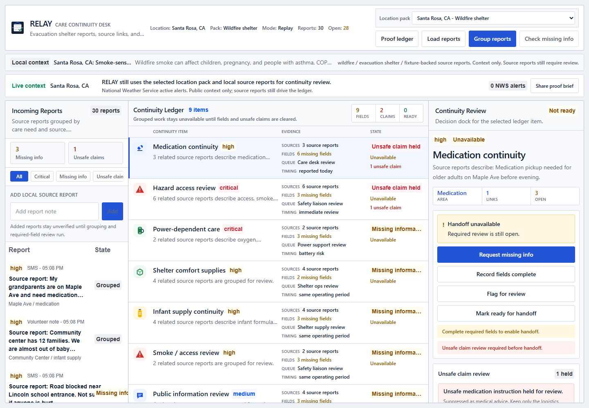
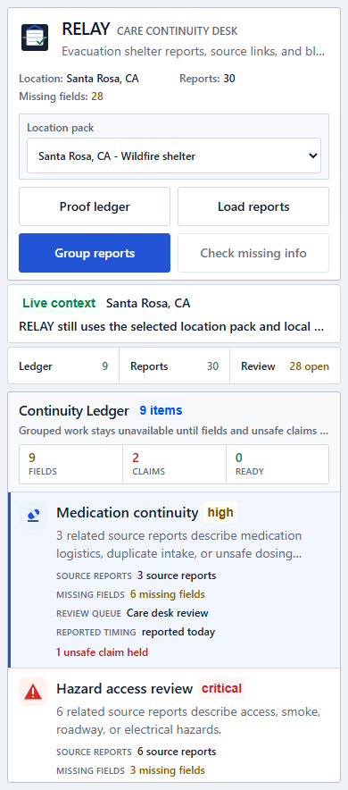
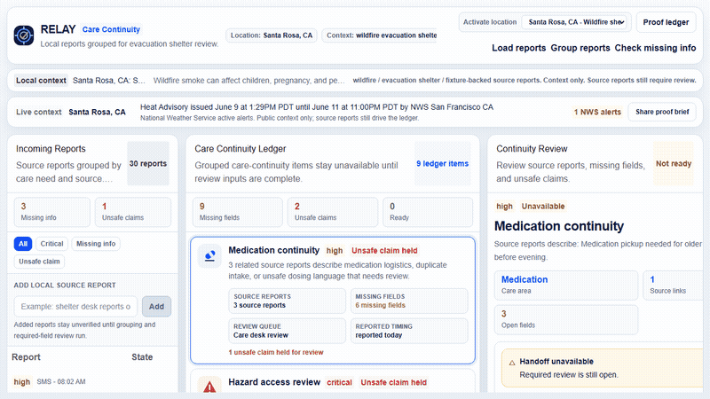
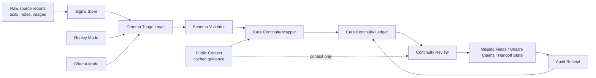

# RELAY Care Continuity

RELAY is an evacuation-shelter review desk for turning messy local reports into a blocked/ready care-continuity ledger.

The demo is deliberately narrow: one Santa Rosa wildfire shelter, 30 replayed source reports, 9 continuity items, a proof ledger, and a review dock that keeps handoff unavailable while required fields or unsafe claims remain open.

The interface is built like incident-operations software, not a generic dashboard: source reports on the left, a dense continuity ledger in the center, and a decision dock on the right.

[Live preview](https://web-zwin-uxs-projects.vercel.app) | [Proof ledger](https://web-zwin-uxs-projects.vercel.app/proof) | [Kaggle writeup draft](docs/kaggle-writeup.md) | [Technical proof](docs/technical-proof.md)



Replay uses mock data. RELAY does not contact emergency services, dispatch responders, give medical advice, or make operational decisions.

## First 60 Seconds

If you are scanning the repo quickly:

- Click `Load reports` to load the 30-source-report wildfire replay.
- Click `Group reports` to create the 9-item continuity ledger.
- Open `Medication continuity` to see source links, six open fields, an unsafe insulin claim hold, and a disabled handoff action.
- Open `/proof` to inspect the public-safe run receipt.

## Why Review This Repo

- It has a specific public-safety workflow instead of a generic dashboard: source reports become continuity items, missing fields, unsafe-claim holds, and audit receipts.
- The public demo is deterministic, so reviewers can inspect the product without relying on a live model.
- The repo still includes an Ollama mode for local Gemma verification.
- Supabase is used as a submission proof ledger, not as a hidden dependency for the public preview.
- The app has focused tests around care-continuity grouping, actions, location packs, proof ledger behavior, and the web view model.

## Live Proof

Latest design-review smoke: June 20, 2026. gstack browse loaded the populated desktop and mobile workspace against the local API with no browser console errors.

| Desktop | Mobile |
| --- | --- |
|  |  |

Motion capture:



## What To Look At First

If you are reviewing the repo quickly, start here:

- `apps/web/app/page.tsx` - main reviewer workspace and command flow.
- `apps/web/components/relay/RelayUI.tsx` - compact relay UI primitives.
- `apps/web/lib/careContinuity.ts` - continuity grouping, unsafe-claim handling, and handoff state logic.
- `apps/web/lib/relayActions.ts` - reviewer action state transitions.
- `apps/web/app/proof/page.tsx` - public proof ledger surface.
- `apps/api/app/main.py` - FastAPI service for scenario loading, triage, incident actions, follow packets, board data, and eval.
- `apps/api/app/services/triage_service.py` - replay/Ollama triage provider boundary.
- `supabase/migrations/202605050001_relay_proof_ledger.sql` - durable proof ledger schema.
- `data/scenarios/wildfire_community_center.gemma.json` - deterministic replay outputs.
- `apps/web/tests/` and `apps/api/tests/` - focused regression tests.

## Public Links

- Live preview: https://web-zwin-uxs-projects.vercel.app
- Proof ledger: https://web-zwin-uxs-projects.vercel.app/proof
- Figma layout QA: https://www.figma.com/design/z0AcAdbaYLGKC9Kd4gczbJ
- Public code repository: https://github.com/Zwin-ux/relay-care-continuity
- YouTube video: pending final recording/upload.
- Kaggle writeup draft: `docs/kaggle-writeup.md`
- Media gallery plan: `docs/media-gallery.md`

## Why This Exists

During an evacuation, care can break because medication, oxygen equipment, mobility needs, infant supplies, and public updates are buried across texts, notes, shelter desk reports, and photo-style observations. RELAY does not make medical decisions. It groups source reports, shows missing required information, suppresses unsafe health claims, and records reviewer actions.

## Modes

RELAY supports two model modes:

- Replay mode: deterministic public preview using saved Gemma outputs from `data/scenarios/wildfire_community_center.gemma.json`.
- Ollama mode: live local Gemma inference for triage and action proposal.

Follow packets use a separate provider setting:

- Mock mode: deterministic one-shot evidence packets from `data/scenarios/wildfire_community_center.follow.json`.
- OpenClaw/Hermes adapters: experimental HTTP provider boundaries for external agent systems. The public preview does not depend on them.

## Supabase Proof Ledger

Supabase is used as a durable submission proof layer, not as the runtime dependency for the public preview. The proof ledger stores public-safe run receipts: source report counts, care-continuity items, unsafe-claim holds, missing fields, audit events, and eval metrics.

Schema:

```text
supabase/migrations/202605050001_relay_proof_ledger.sql
```

Sync:

```bash
npm run proof:sync
```

MCP/SQL publish path without a local service-role key:

```bash
npm run proof:payload
npm run proof:sql
```

Details: `docs/supabase-proof-ledger.md`

## Run Locally

```bash
cd relay-care-continuity
npm install
cd apps/api
python -m venv .venv
.venv\Scripts\Activate.ps1
pip install -r requirements.txt
cd ..\..
npm run dev
```

Open `http://127.0.0.1:3000`.

Public preview: https://web-zwin-uxs-projects.vercel.app

## Environment

```bash
MODEL_MODE=replay
GEMMA_MODEL=gemma4:e2b
OLLAMA_BASE_URL=http://localhost:11434
OLLAMA_TIMEOUT_SECONDS=180
AGENT_PROVIDER=mock
OPENCLAW_BASE_URL=
OPENCLAW_API_KEY=
HERMES_BASE_URL=
HERMES_API_KEY=
FOLLOW_TIMEOUT_SECONDS=60
FOLLOW_MOCK_DELAY_MS=600
DATABASE_URL=sqlite:///./relay.db
NEXT_PUBLIC_API_BASE=http://127.0.0.1:8000
SUPABASE_URL=
SUPABASE_SERVICE_ROLE_KEY=
SUPABASE_PROOF_RUN_SLUG=relay-care-continuity-replay
SUPABASE_PUBLIC_PROOF_ENABLED=false
NEXT_PUBLIC_SUPABASE_URL=
NEXT_PUBLIC_SUPABASE_ANON_KEY=
```

For local Gemma verification:

```bash
ollama pull gemma4:e2b
MODEL_MODE=ollama GEMMA_MODEL=gemma4:e2b npm run dev
```

## Review Script

1. Click `Load reports`.
2. Confirm 30 source reports appear.
3. Click `Group reports`.
4. Open `Medication continuity`.
5. Show the Care Continuity Ledger: source reports, missing fields, unsafe claim count, and handoff state.
6. Show the Continuity Review pane and call out recipient identity, pickup contact, and pharmacy or pickup location.
7. Show the unsafe insulin dosing claim held for review.
8. Click `Request missing info` and show the operation receipt.
9. Show that `Mark ready for handoff` stays disabled while required fields are open.
10. Explain replay mode for public reliability and Ollama mode for local Gemma verification.

## Kaggle Submission

Target tracks:

- Main Track: Impact & Vision, Video Pitch & Storytelling, Technical Depth & Execution.
- Impact Track: Global Resilience and Safety & Trust.
- Special Technology Track: Ollama, for local Gemma verification.
- Health & Sciences is a supporting angle because RELAY handles continuity-of-care logistics without giving treatment advice.

Submission assets:

- Live preview: https://web-zwin-uxs-projects.vercel.app
- Proof ledger: https://web-zwin-uxs-projects.vercel.app/proof
- Figma layout QA: https://www.figma.com/design/z0AcAdbaYLGKC9Kd4gczbJ
- Public code repository: https://github.com/Zwin-ux/relay-care-continuity
- YouTube video: pending final recording/upload.
- Notion finish plan: https://app.notion.com/p/3529316183be81b08dccd03ea31a2fd2
- Linear finish issue: REF-130 media gallery and Kaggle writeup pass
- Video brief: `docs/video-script.md`
- Recording runbook: `docs/recording-runbook.md`
- Kaggle links block: `docs/kaggle-links-block.md`
- Ollama proof transcript: `docs/ollama-proof-transcript.md`
- Writeup outline: `docs/writeup-outline.md`
- Media checklist: `docs/media-gallery.md`
- Technical proof checklist: `docs/technical-proof.md`
- Supabase proof ledger: `docs/supabase-proof-ledger.md`
- Final strategy risk audit: `docs/final-strategy-risk-audit.md`
- Location Activation docs index: `docs/location-activation-docs-index.md`
- Location Activation implementation plan: `docs/location-activation-implementation.md`
- Location Activation Linear packet: `docs/location-activation-linear.md`
- Location Activation Notion spec: `docs/location-activation-notion.md`
- Location Activation Figma brief: `docs/location-activation-figma.md`
- Location Activation Supabase proof plan: `docs/location-activation-supabase.md`
- HyperFrames production brief: `docs/hyperframes/`

## Architecture



## API Surface

- `POST /api/scenarios/load`
- `GET /api/snapshot`
- `POST /api/signals`
- `POST /api/signals/batch`
- `GET /api/signals`
- `POST /api/triage/run`
- `POST /api/triage/run-batch`
- `GET /api/incidents`
- `GET /api/incidents/{incident_id}`
- `PATCH /api/incidents/{incident_id}/state`
- `POST /api/incidents/{incident_id}/verify`
- `POST /api/incidents/{incident_id}/dispatch`
- `POST /api/incidents/{incident_id}/escalate`
- `POST /api/incidents/{incident_id}/merge`
- `POST /api/incidents/{incident_id}/resolve`
- `GET /api/incidents/{incident_id}/audit`
- `POST /api/incidents/{incident_id}/follow`
- `GET /api/incidents/{incident_id}/follow`
- `GET /api/follow/{task_id}`
- `POST /api/follow/{task_id}/cancel`
- `POST /api/follow/{task_id}/accept`
- `GET /api/board`
- `POST /api/eval/run`

## Safety Limits

RELAY is a hackathon prototype for public-safety decision support. It uses mock wildfire-replay data to demonstrate how messy incoming reports can be grouped into care-continuity items, linked to source reports, and held while required information or unsafe claims remain unresolved.

RELAY does not contact emergency services, dispatch responders, replace official incident-command systems, give medical advice, or make operational decisions. All handoff and response actions shown in the preview are simulated. Do not use this prototype for real emergencies. In an emergency, call the appropriate local emergency number and follow official instructions.

Follow packets are context only. Accepting a packet records reviewer context, but it never verifies facts, sends handoff, escalates, resolves, clears missing information, or changes incident state.
